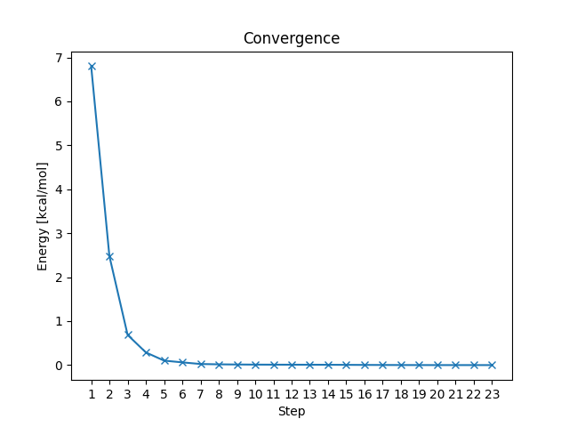

# Convergence

This is a simple python program that will plot the convergence of a geometry optimizaton in Gaussian 16, using Matplotlib.

Usage: py convergence.py <name_of_file.log>

Here is an example output:

